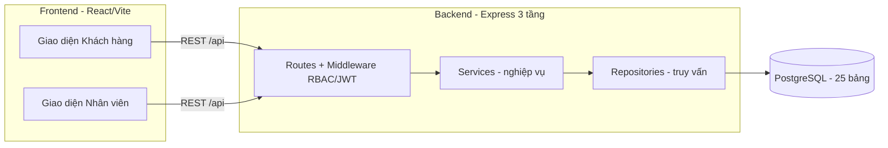
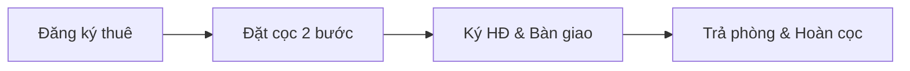

# 🏠 HomeStay Dorm — Hệ thống quản lý ký túc xá tư nhân

> Đồ án môn **Phân tích & Thiết kế Hệ thống Thông tin (CSC12004)** — Nhóm 12
> Khoa Công nghệ Thông tin, Trường ĐH Khoa học Tự nhiên – ĐHQG-HCM

Ứng dụng web quản lý toàn bộ nghiệp vụ của một ký túc xá tư nhân: từ **đăng ký thuê →
đặt cọc (quy trình 2 bước) → ký hợp đồng & bàn giao → trả phòng & hoàn cọc**. Hỗ trợ thuê
nguyên căn hoặc ở ghép theo giường, thuê theo nhóm, phân quyền theo vai trò và theo chi nhánh,
thông báo thời gian thực và nhật ký hệ thống.

---

## Link trang web

Link: https://homestay-dorm-nhom12.vercel.app/

## 📌 Mục lục

- [Bối cảnh & phạm vi](#-bối-cảnh--phạm-vi)
- [Tính năng chính](#-tính-năng-chính)
- [Vai trò người dùng](#-vai-trò-người-dùng)
- [Công nghệ sử dụng](#-công-nghệ-sử-dụng)
- [Kiến trúc hệ thống](#-kiến-trúc-hệ-thống)
- [Cấu trúc thư mục](#-cấu-trúc-thư-mục)
- [Cơ sở dữ liệu](#-cơ-sở-dữ-liệu)
- [Cài đặt & chạy ở máy local](#-cài-đặt--chạy-ở-máy-local)
- [Tài khoản demo](#-tài-khoản-demo)
- [Kiểm thử](#-kiểm-thử)
- [Triển khai lên Internet](#-triển-khai-lên-internet)
- [Phân công nhóm](#-phân-công-nhóm)
- [Thành viên](#-thành-viên)

---

## 🎯 Bối cảnh & phạm vi

Ký túc xá tư nhân **HomeStay Dorm** cung cấp dịch vụ lưu trú dài hạn cho khách cá nhân và tổ chức.
Hệ thống số hóa 4 quy trình nghiệp vụ cốt lõi:

1. **Đăng ký thuê phòng** — khách cung cấp tiêu chí (khu vực, loại phòng, giới tính, giá, số người…),
   nhân viên Sale kiểm tra phòng/giường trống và sắp xếp lịch xem phòng.
2. **Đặt cọc & xác nhận thuê** — tính tiền cọc, thu cọc và ghi nhận giữ chỗ.
   Tiền cọc = **(tiền thuê 2 tháng) × (số giường thuê)**; hạn thanh toán **24 giờ**, quá hạn tự hủy.
3. **Nhận phòng, ký hợp đồng & bàn giao** — kiểm tra điều kiện lưu trú, ký hợp đồng,
   thu tiền thuê kỳ đầu và bàn giao phòng/tài sản.
4. **Trả phòng & hoàn cọc** — kiểm tra hiện trạng, đối soát và hoàn cọc theo tỷ lệ, trừ các khoản phát sinh.

**Tỷ lệ hoàn cọc** (cấu hình được theo chi nhánh):

| Tình huống | Tỷ lệ hoàn |
|---|---|
| Đã cọc nhưng chưa ký hợp đồng | 80% |
| Đã ký, lưu trú **dưới** 6 tháng | 50% |
| Đã ký, lưu trú **trên** 6 tháng | 70% |
| Hết hạn hợp đồng | 100% |

---

## ✨ Tính năng chính

- 🔎 **Khách hàng:** đăng ký tài khoản, tìm & xem phòng/giường theo tiêu chí, tự lập phiếu đăng ký thuê,
  xem "Đơn của tôi", thanh toán cọc (tiền mặt / chuyển khoản), đăng ký trả phòng.
- 🧾 **Sale:** tiếp nhận & xử lý đơn, hẹn/đánh dấu xem phòng, lập phiếu đặt cọc (giữ giường 24h),
  lập yêu cầu hủy cọc, tạo phiếu trả phòng.
- 💰 **Kế toán:** đối soát tiền cọc (bước 1), tính hoàn cọc & lập bảng đối soát, hoàn cọc / thu chênh lệch,
  xem giao dịch thanh toán.
- 🗂️ **Quản lý:** chốt cọc (bước 2), kiểm tra điều kiện lưu trú (cá nhân & nhóm), lập & ký hợp đồng,
  bàn giao phòng, quản lý phòng/giường, cấu hình chi nhánh.
- 🛠️ **Quản trị hệ thống (Admin/IT):** quản lý tài khoản nhân viên, chi nhánh, điều kiện cho thuê, nhật ký hệ thống.
- 🔔 **Chung:** thông báo theo cá nhân/vai trò, phân quyền theo chi nhánh, dashboard thống kê.

**Điểm nhấn nghiệp vụ:**

- **Đặt cọc 2 bước kiểm soát chéo:** Kế toán *đối soát* số tiền thực nhận → Quản lý *chốt* → mới hoàn tất.
- **Thuê theo nhóm:** kiểm tra điều kiện từng thành viên, loại người không đạt và **hoàn cọc phần giường giảm**.
- **Giữ giường nguyên tử** khi lập cọc, chống tranh chấp đặt trùng.
- **Phân quyền theo chi nhánh:** nhân viên toàn hệ thống (thấy mọi chi nhánh) vs nhân viên khu vực.

---

## 👥 Vai trò người dùng

| Vai trò | Mô tả |
|---|---|
| `customer` | Khách hàng — tự đăng ký tài khoản, đặt thuê, thanh toán, theo dõi đơn. |
| `sale` | Nhân viên kinh doanh — tiếp nhận đơn, lập cọc, lập phiếu trả phòng. |
| `manager` | Quản lý nghiệp vụ — chốt cọc, ký hợp đồng, bàn giao, quản lý phòng. |
| `accountant` | Kế toán — đối soát, hoàn cọc, giao dịch tài chính. |
| `admin` | Quản trị hệ thống (IT) — tài khoản, chi nhánh, cấu hình, nhật ký. |

---

## 🧰 Công nghệ sử dụng

**Frontend** — `homestay-dorm/`
- React 19 + Vite, Tailwind CSS, React Router, Recharts
- Code-splitting theo trang (React.lazy), Context API cho xác thực

**Backend** — `homestay-dorm-api/`
- Node.js (ESM) + Express, kiến trúc **3 tầng**: `routes → services → repositories`
- PostgreSQL qua `pg`, xác thực **JWT**, băm mật khẩu **bcryptjs**
- Phân quyền theo vai trò (RBAC) + theo chi nhánh

**Cơ sở dữ liệu**
- PostgreSQL (triển khai trên Supabase), **25 bảng**, ràng buộc CHECK và JSONB

---

## 🏗️ Kiến trúc hệ thống



Luồng nghiệp vụ tổng quát:



---

## 📁 Cấu trúc thư mục

```
.
├── homestay-dorm/            # Frontend — React 19 + Vite + Tailwind
│   └── src/
│       ├── pages/            # customer/ + staff/(sale, manager, accountant, admin)
│       ├── components/       # customer/, staff/, ui/
│       ├── layouts/          # CustomerLayout, StaffLayout
│       ├── context/          # AuthContext
│       └── lib/              # api.js + helpers giao diện theo vai trò
├── homestay-dorm-api/        # Backend — Express + PostgreSQL
│   ├── src/
│   │   ├── routes/           # 12 nhóm route (auth, rooms, bookings, deposits, …)
│   │   ├── services/         # logic nghiệp vụ
│   │   ├── repositories/     # truy vấn CSDL
│   │   ├── middleware/       # auth (JWT/RBAC), errorHandler
│   │   └── config/           # kết nối PostgreSQL
│   └── tests/                # kiểm thử e2e nghiệp vụ
├── 12_tao_csdl_ver3.sql      # Script tạo CSDL hợp nhất (chạy 1 lần trên DB trống)
├── DEPLOY_HUONG_DAN.md       # Hướng dẫn deploy (Supabase + Render + Vercel)
└── README.md
```

---

## 🗄️ Cơ sở dữ liệu

CSDL quan hệ trên PostgreSQL gồm **25 bảng**, tổ chức theo các nhóm chức năng:

| Nhóm | Bảng tiêu biểu |
|---|---|
| Quản trị & cấu hình | `chi_nhanh`, `nhan_vien`, `quy_dinh_cho_thue`, `cau_hinh_he_thong` |
| Lưu trú | `phong`, `giuong` |
| Khách hàng & nhóm thuê | `khach_hang`, `nhom_thue`, `nhom_thue_thanh_vien` |
| Đăng ký thuê | `phieu_dang_ky_thue`, `lich_xem_phong` |
| Đặt cọc (2 bước) | `phieu_dat_coc`, `chi_tiet_dat_coc` |
| Hợp đồng & bàn giao | `hop_dong_thue`, `chi_tiet_hop_dong`, `phi_dich_vu`, `bien_ban_ban_giao`, `tai_san` |
| Trả phòng & hoàn cọc | `phieu_tra_phong`, `bien_ban_tra_phong`, `bang_doi_soat`, `khoan_khau_tru` |
| Giao dịch, nhật ký, thông báo | `giao_dich_thanh_toan`, `nhat_ky_he_thong`, `thong_bao` |

- **Ràng buộc CHECK** khóa chặt các trạng thái của phiếu cọc, hợp đồng, giường.
- **JSONB** cho dữ liệu động: `tieu_chi` (phiếu đăng ký), `tien_ich` (phòng), `ket_qua_kiem_tra` (biên bản).
- **Audit log** (`nhat_ky_he_thong`) ghi lại mọi hành động của nhân viên.
- Kèm sẵn **dữ liệu mẫu**: 3 chi nhánh, tài khoản nhân viên demo.

> ⚠️ Chạy `12_tao_csdl_ver3.sql` **một lần** trên một database PostgreSQL trống
> (đầu script tự `DROP` toàn bộ bảng để chạy lại được).

---

## 🚀 Cài đặt & chạy ở máy local

**Yêu cầu:** Node.js ≥ 18, một database PostgreSQL (local hoặc Supabase).

**1) Cơ sở dữ liệu**
```bash
psql "<DATABASE_URL>" -f 12_tao_csdl_ver3.sql
```

**2) Backend** (`homestay-dorm-api/`)
```bash
cd homestay-dorm-api
cp .env.example .env          # sửa DATABASE_URL, JWT_SECRET trong .env
npm install
npm start                     # mặc định http://localhost:4000
```

**3) Frontend** (`homestay-dorm/`)
```bash
cd homestay-dorm
npm install
npm run dev                   # http://localhost:5173
```

> Frontend đọc địa chỉ API qua biến `VITE_API_URL` (mặc định `http://localhost:4000/api`).
> Khi deploy phải đặt lại biến này trỏ về backend thật.

---

## 🔑 Tài khoản demo

Mật khẩu chung: `123456`

| Vai trò | Email |
|---|---|
| Sale | `sale@homestay.vn` |
| Quản lý | `manager@homestay.vn` |
| Kế toán | `accountant@homestay.vn` |
| Admin | `admin@homestay.vn` |

Khách hàng: tự đăng ký tài khoản mới trên giao diện.

---

## 🧪 Kiểm thử

Bộ kiểm thử end-to-end mô phỏng toàn bộ nghiệp vụ qua HTTP (trong `homestay-dorm-api/tests/`):

```bash
cd homestay-dorm-api
npm start                     # cửa sổ 1 — chạy API (trỏ về DB test)
node tests/e2e.js             # cửa sổ 2 — chạy kịch bản
```

| Bộ test | Nội dung | Kết quả |
|---|---|---|
| `e2e.js` | Luồng thuê cá nhân đầy đủ (đăng ký → cọc 2 bước → HĐ → trả phòng) | 34/34 ✅ |
| `group_e2e.js` | Thuê theo nhóm, kiểm tra điều kiện, hoàn 80% | 19/19 ✅ |
| `group_reduce_e2e.js` | Giảm giường & hoàn cọc phần giảm | 13/13 ✅ |
| `rent_fix_e2e.js` | Công thức tiền thuê/tháng theo `so_thang_coc` | 4/4 ✅ |

> Tổng: **70/70** kiểm thử nghiệp vụ đạt.

---

## ☁️ Triển khai lên Internet

Xem chi tiết trong [`DEPLOY_HUONG_DAN.md`](DEPLOY_HUONG_DAN.md):

- **Database →** Supabase (PostgreSQL)
- **Backend →** Render
- **Frontend →** Vercel

---

## 🧑‍💻 Phân công nhóm

Mỗi thành viên cài đặt một **chức năng chính bám sát nghiệp vụ**, kèm phần **hạ tầng chung** và
**giao diện khách (phụ)**:

| TV | Chức năng chính (nghiệp vụ) | Phần chung | Giao diện khách (phụ) |
|----|------------------------------|------------|------------------------|
| **A** | Đăng ký thuê & lịch xem phòng | Phân quyền + Quản trị hệ thống | Hành trình đặt phòng & đăng nhập phía khách |
| **B** | Đặt cọc & xác nhận thuê (2 bước) & hủy/hoàn cọc trước thuê | Xem giao dịch + nền backend/CSDL | Màn thanh toán cọc phía khách |
| **C** | Đăng nhập, Quản lý phòng giường & Lập phiếu cọc | Thông báo + định tuyến FE | Hủy đơn & tương tác khách |
| **D** | Ký hợp đồng & bàn giao phòng | Đăng ký thuê theo nhóm | Trang chủ & khung giao diện khách |
| **E** | Trả phòng & hoàn cọc | Cấu hình chi nhánh + Thống kê/Dashboard | Đăng ký trả phòng phía khách |

---

## 👨‍👩‍👧‍👦 Thành viên

Nhóm 12 — Lớp CQ2023/12:

| MSSV | Họ và tên | Vai trò trong nhóm |
|---|---|---|
| 21120089 | Trần Đăng Khoa | _(điền A/B/C/D/E)_ |
| 21120595 | Nguyễn Thành Vinh | _A_ |
| 23120102 | Nguyễn Ngọc Minh Tuấn | _B_ |
| 23122050 | Nguyễn Tấn Tài | _D_ |
| 23122054 | Kpuih Thuing | _E_ |

---

<p align="center"><i>Đồ án môn Phân tích & Thiết kế Hệ thống Thông tin (CSC12004) — Nhóm 12 · 2026</i></p>
